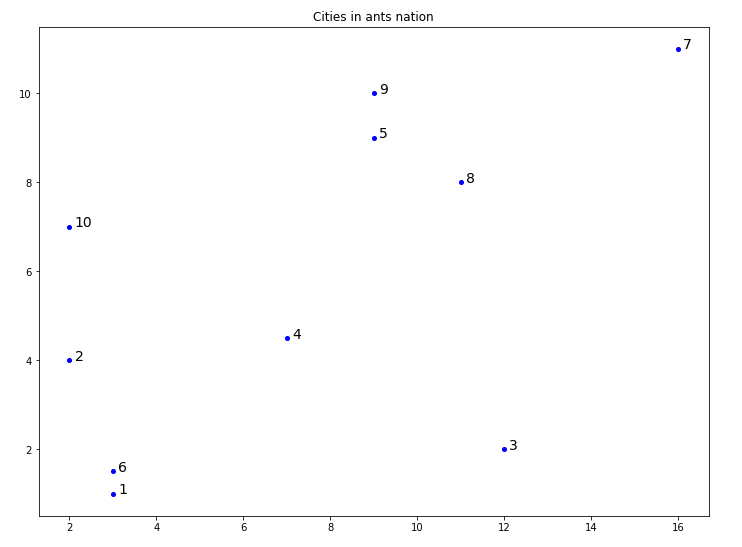

# Introduction
Ant systems are robust and flexible algorithms for solving non-trivial combinatorial optimization problems, with the use of simulated ant colonies, i.e. multi-agent approach with positive
feedback. In this report we will simulate the behaviour of ant colony in presence of two paths
on a single symmetric bridge between the nest and food; we will also fin the shortest path going
through all cities given on a 2D plane, that is, we will present an ant-based solution to the
travelling salesman problem.

# The travelling salesman
To determine the shortest path going through every city given by coordinates, like this:
`x = [3 2 12 7 9 3 16 11 9 2]; y = [1 4 2 4.5 9 1.5 11 8 10 7];`

Distances are calculated and equal trace of pheromone is placed on every path between the cities. Then, _m_ ants are created, with a boolean vector of visited cities and two variables, storing tour length and current city (visible above). Each ant is also assigned a value in a dictionary _tours_, corresponding to the cities it traveled to on its tour, in order. We perform a random selection of starting points for our ants, which will remain their starting points throughout the algorithm, hence the name _hometowns_. Each ant then chooses the next city to go to, based on the amount of pheromone on feasible paths and the distance. Probability of choosing city _j_ is given by the _j_-th column in the decision table _a_, where indices represent ants (shown below). When each ant visits all _N_ cities, the pheromones of the best ants are deposited on appropriate paths and our cybernetic insects start the tour again, until they perform set amount of tours.

After each iteration, the shortest path is evaluated, and the optimal path is selected from all the tours. The results are presented on a graph, representing the map of considered cities, with gray connections being the amount of pheromones squared, and the green line being the optimal path (figures below). A preview of the shortest path in each tour is available, together with the percentage of the ants that took it. The optimal path and its length are then printed out. For _m = 20_ the optimal solution is more frequent towards the final tours and the less ants are allowed to leave the pheromone, the higher likelihood of getting stuck on a suboptimal path.

